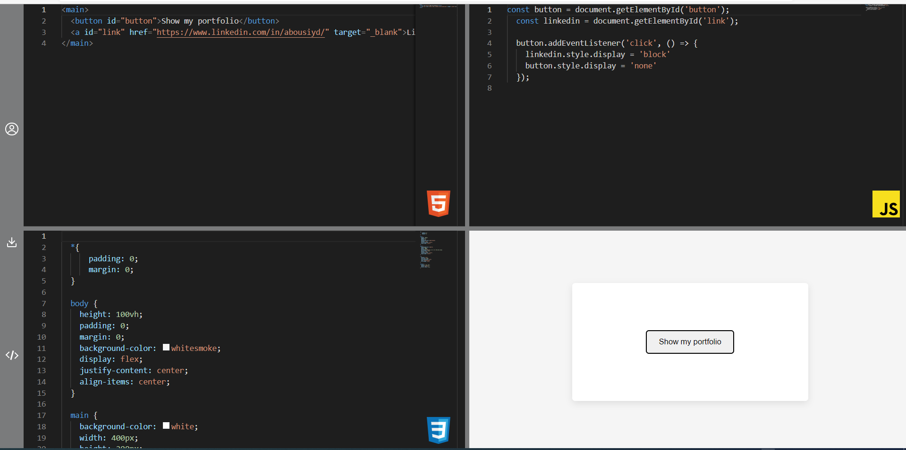

# Codepen with React

Welcome to my new project where I put in practice the knowledge that i've acquired. It's been a very challenging journey but i feel very proud about the job done.

The project is a clone of the popular Codepen web.

It lets you write code in html, css or js, and it renders the preview as an output.

It also allows you to download the code written in a zip format, and customize the editor settings.

I'm still working in the app, adding new features and optimizations. I would love you to take a look on the app and any feedback is appreciate it!

## Setup

To start the project run the following command:

### `npm i && npm start`

Then open [http://localhost:3000](http://localhost:3000) to view it in the browser.
